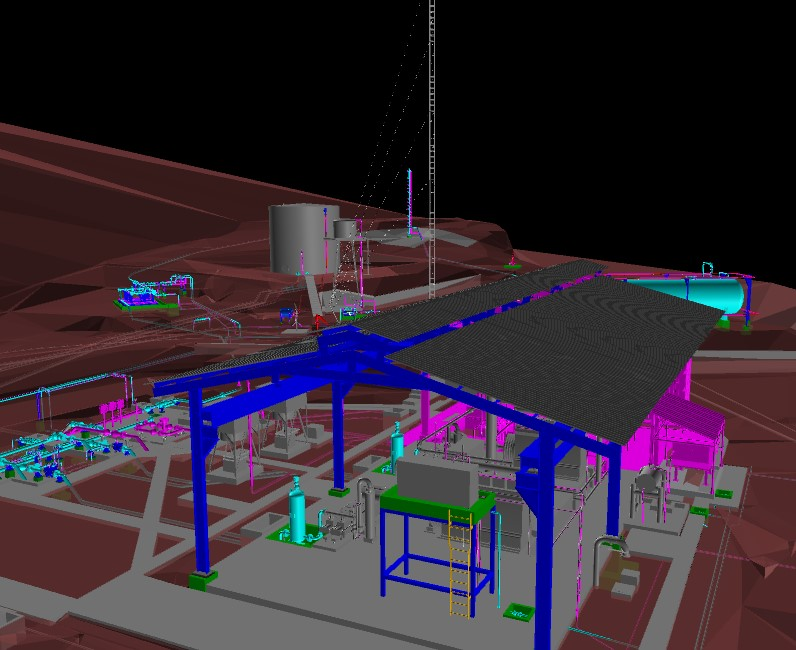
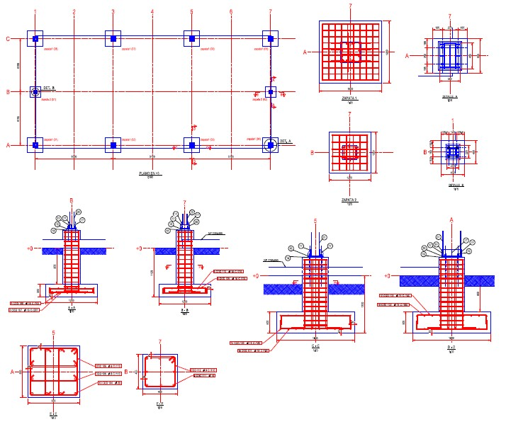
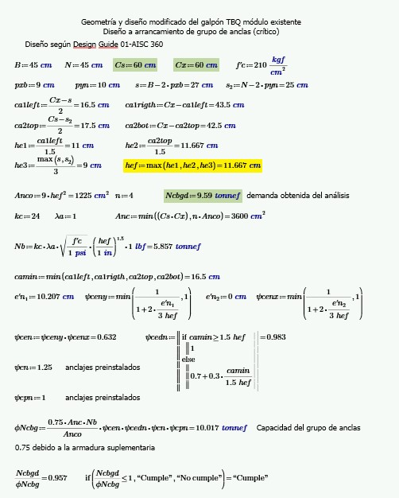

# PORTAFOLIO DE PROYECTOS
Este es un resumen de los proyectos académicos y de Ingeniería que he realizado.

[Link to LinkedIn](https://www.linkedin.com/in/sebasti%C3%A1n-meneses-flores-2694211ab).

Participé en diversos proyectos de **Ingeniería Estructural**.
Mi experiencia se extiende desde la etapa de Ingeniería básica hasta la ingeniería de detalle y fabricación en estructuras de acero, madera y hormigón.

# Proyecto Torre de Acopio de Granos
Torre de 45m de altura y 6x6 metros de base, conecta silos de acopio de granos con puentes metálicos y alberga un elevador de granos en el centro. Estructura tipo Truss tower. Diseño especial de conexiones y placa base. Ingeniería de detalle y fabricación.

    
    

    
    

# Proyecto Galpón con Puente Grúa (sismoresistente)
Ampliación de Estructuras Sismoresistentes con puente grúa.

    
    

    
    

# Proyecto Estructura de Hormigón "Comercial"
Estructura de hormigón con losa casetonada

    
    

    
    

# Hojas de cálculo en Mathcad

    
    

# Proyecto de Verificación Estructural con paneles solares
Estructura cubierta tipo espacial de 39x19 metros de área. 

    
    

    
    

# Diseño y cálculo de conexiones en IdeaStatica

    
    

    
    

    
    

# Proyecto Torre Alta
Residente de obra en el proyecto de edificación de gran altura. 
Losas casetonadas y fundaciones con pilotes Full Displacement Pile + Expander Body

    
    

    
    

    
    

# Estructuras de Hormigón para Ampliación de planta cementera
Residente de obra en la primera fase de estructuras de Hormigón para ampliación de producción de Clinker.

    
    

    
    

